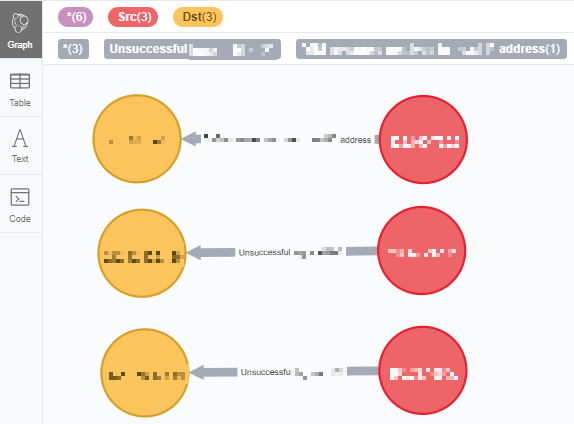

# Use Neo4j APOC Plugin To Query Elasticsearch Data
---

## 目的
透過此篇文章，您可以學到以下內容：
* APOC 查詢 Elasticsearch 資料
* Neo4j 圖型視覺化 Elasticsearch 中的連線紀錄 

## 參考文獻
* [APOC User Guide](https://neo4j-contrib.github.io/neo4j-apoc-procedures/)
* [Exploring Neo4j Database Metadata in APOC (#3)](https://www.youtube.com/watch?v=yEN6TCL8WGk)

## 版本資訊
* Neo4j Server: 3.3.4 (community)
* Neo4j Browser: 3.2.15
* APOC: 3.3.0.4
* Elasticsearch: 5.4.1

## 問題需求
Elasticsearch (ES) 每筆資料內容如下，資料 src 與 dst 具有關聯性，希望進行小批資料、暫時性及快速關聯分析。

|src|sACC|dst|dACC|rule|
|---|---|---|---|---|
|1.1.1.1|單位1|4.4.4.4|null|Unsuccessful_logon_SSH|
|2.2.2.2|單位2|5.5.5.5|null|Unsuccessful_logon_RDP|
|3.3.3.3|單位3|6.6.6.6|null|Unsuccessful_logon_TELNET|

## 解決方法概念
1. 資料中 src 對 dst 進行連線行為，此紀錄可透過圖形化呈現關聯性，因此選擇將資料匯入 Neo4j 圖型資料庫進行關聯分析。
2. 資料探索過程僅需小批資料呈現，故希望透過 Neo4j 與 APOC 直接在 Cypher-shell 進行資料處理。

## 解決方法細節
### 1. Get ES basic Information
先蒐集 ES Server基本資訊，以利後續 APOC 使用，其中 [ES QueryDSL](https://www.elastic.co/guide/en/elasticsearch/reference/current/query-dsl.html)為 ES 資料查詢語法，該語法顯示查詢 ES 所有資料但只回傳3筆資料。
```bash
ES host: 10.10.10.10
ES index: connection_log
ES document type: log
ES QueryDSL: {size:3, query:{match_all:{}}}
```

### 2. Write APOC and Cypher Query Language
於 Cypher-shell 介面撰寫以下語法並進行說明：
```bash
CALL apoc.es.query("10.10.10.10","connection_log","log",null,{size:3, query:{match_all:{}}}) YIELD value
UNWIND value.hits.hits as data
MERGE (src:Src {ip:data._source.src}) ON CREATE SET src.acc = data._source.sACC
MERGE (dst:Dst {ip:data._source.dst}) ON CREATE SET dst.acc = data._source.dACC

WITH src, dst, data._source.ruleName AS ruleName
CALL apoc.create.relationship(src, ruleName, {}, dst) YIELD rel
RETURN rel
```
#### 2.1. 透過 apoc.es.query() 對 ES 查詢資料，並回傳為 value。
apoc.es.query()該方法透過YIELD內建函數回傳變數需固定名稱為value，詳見[官方文件](https://neo4j-contrib.github.io/neo4j-apoc-procedures/)。此外，查詢 ES 回傳的 value 資料為 JSON 格式，內容如下。
```bash
{
  "_shards": {
    "total": 5,
    "successful": 5,
    "failed": 0
  },
  "hits": {
    "hits": [
      {
        "_type": "log",
        "_source": {
			"src": 1.1.1.1
			"sACC": "單位1"
			"dst": 4.4.4.4
			"dACC": null
			"rule": "Unsuccessful_logon_SSH"
        },
        "_id": "AWgWwRRsOsKWvR1r3z2h",
        "_index": "connection_log",
        "_score": 1.0
      },
      {
        "_type": "log",
        "_source": {
			"src": 2.2.2.2
			"sACC": "單位2"
			"dst": 5.5.5.5
			"dACC": null
			"rule": "Unsuccessful_logon_RDP"
        },
        "_id": "AWgWwRRsOsKWvR1r3z2l",
        "_index": "connection_log",
        "_score": 1.0
      },
      {
        "_type": "log",
        "_source": {
			"src": 3.3.3.3
			"sACC": "單位3"
			"dst": 6.6.6.6
			"dACC": null
			"rule": "Unsuccessful_logon_TELNET"
        },
        "_id": "AWgWwRRsOsKWvR1r3z2n",
        "_index": "connection_log",
        "_score": 1.0
      }
    ],
    "total": 100,
    "max_score": 1.0
  },
  "took": 150,
  "timed_out": false
}
```

#### 2.2. 透過 Cypher 對資料進行處理並建立圖型 Node
由 ES 回傳的 JSON 資料可知，需要圖型化的連線紀錄置於 hits.hits 巢狀架構中，因此透過 [Cypher UNWIND](https://neo4j.com/docs/cypher-manual/current/clauses/unwind/) 語法將資料取出並指定為 data，後續透過 [Cypher MERGE](https://neo4j.com/docs/cypher-manual/current/clauses/merge/)查詢資料庫中是否已有該 Node，沒有則建立 Node。值得一提的是，因欄位資料 dACC 為空值，用 MERGE 建立 [node property](https://neo4j.com/docs/getting-started/current/graphdb-concepts/#graphdb-properties) 會出錯，因此搭配使用 [Cypher ON CREATE](https://neo4j.com/docs/cypher-manual/current/clauses/merge/#merge-merge-with-on-create)，指定 property 值。

#### 2.3. 透過 apoc.create.relationship() 建立關聯
因希望動態取得欄位 rule 資料並建立欄位 src 與 dst 之間的關聯，因此使用 apoc.create.relationship()，相關參數詳見官方文件，以Neo4j Browser呈現結果如下圖。


### 問題與討論
1. 進行小批資料視覺化連線紀錄，以利透過圖型方式進行關聯分析，假如 Elasticsearch 資料量大，需測試其他機制將資料大量匯入 Neo4j 並進行圖像化效能調校。
